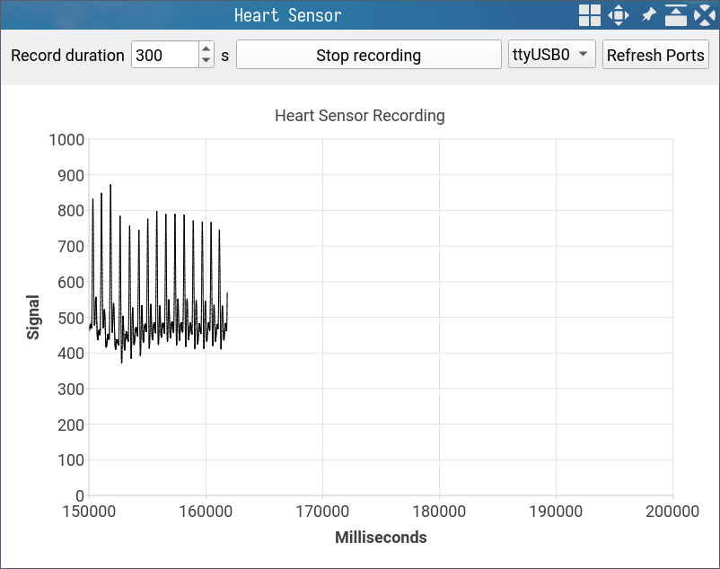

# heart-sensor GUI

This is a small QT-based application for reading data from a heart rate sensor connected to Arduino.



## Compiling

It can easily be compiled using `qmake` and `make` tools:

```bash
cd project
qmake -makefile
make
```

## Running

Just run in terminal:

```bash
./sensorqt
```
